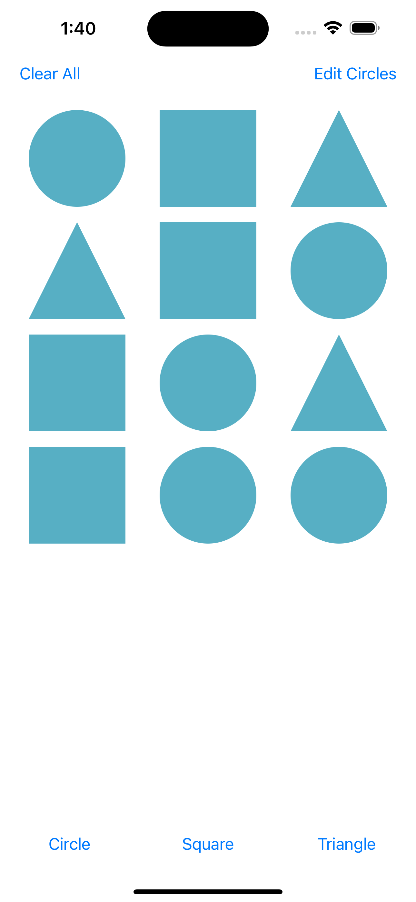
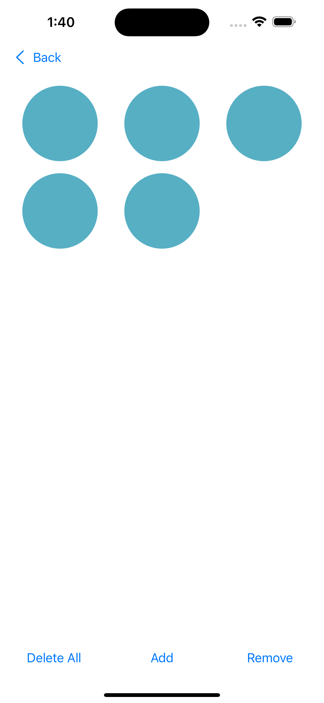

# CricutShapesApp

An iOS SwiftUI application built for the Cricut engineering candidate assessment. This app demonstrates structured concurrency, modular design using Swift Package Manager, and separation of concerns across layers of networking, domain, and presentation logic.

## 📸 Screenshots

| Shape Grid View | Circle Editor View |
|------------------|--------------------|
|  |  |

## 🯩 Features

* **Dynamic Shape Grid**: Fetches shape definitions from a remote API and renders corresponding shape buttons.
* **Composable Views**: Includes three main views:

  * **CricutShapes**: The main container view that coordinates navigation, shared state, and shape editing flows using a view model and injected shape services.
  * **GridEditor**: Displays all shapes in a grid with dynamic buttons and supports injected toolbars or footers.
  * **ShapesGrid**: A pure view that renders a flexible SwiftUI LazyVGrid layout based on shape data, suitable for embedding within higher-level editors.
* **View Injection with @ViewBuilder**: Key views like GridEditor accept injected footers or toolbars using @ViewBuilder, enabling flexible reuse and UI composition while preserving type safety and SwiftUI layout performance.
* **In-Memory State Synchronization**: Shared shape state is updated live across both views using a central view model.
* **Custom Design System**: Uses a custom color (`BrandPrimary`) defined via asset catalog and exposed via extension.
* **Safe Navigation**: Implements `NavigationStack` with `@Published` navigation path for type-safe and observable routing.
* **Encapsulation of Networking Logic**: DTOs and decoding logic remain internal to `ShapeKit`. The main app consumes domain models only.

## 💠 Architecture

* **MVVM** with clear separation of:

  * `View` (`GridEditor`, `ShapesGrid`)
  * `ViewModel` (`CricutShapesViewModel`)
  * `Model` (`ShapeDefinition`, `ShapeType`)
  * `Service` (`ShapesServiceRepresentable`, `ShapesService`)
  * `DTO`/Mapping (`ShapeDefinitionDTO`, `DTOMapper`)
* **Modular Design**:

  * App logic lives in `CricutShapesApp`
  * Reusable shared logic lives in a local Swift package `ShapeKit`

## 📦 Project Structure

```
CricutShapesApp/
├── App/                  # App entry point
├── View/                 # Key views
├── ViewModel/            # ObservableObject ViewModels
├── Resources/            # Assets and colors
├── ShapeKit/             # Local SPM package
│   ├── Model/            # Domain models (ShapeType, ShapeDefinition)
│   ├── Networking/       # DTOs and network service
│   ├── Protocols/        # Protocols for abstraction
│   ├── Mappers/          # DTO → Model mapping
```

## 🚀 Getting Started

1. Open `CricutShapesApp.xcodeproj` in Xcode 15+.
2. Build & run on any iOS 17+ device or simulator.
3. On first load, the app fetches shape definitions from:

   ```
   https://staticcontent.cricut.com/static/test/shapes_001.json
   ```

## 🔪 Preview Support

* The app and views (`CricutShapes`, `GridEditor`, `ShapesGrid`, & `Triangle`) include SwiftUI previews powered by mock services.
* Network layer is abstracted via `ShapesServiceRepresentable` for ease of mocking and testing.

## 📱 Requirements

* iOS 17+
* Swift 5.9+
* Xcode 15+

## 🔒 Notes

* All DTOs are internal to `ShapeKit` and never leak to the app boundary.
* Swift Concurrency is strictly followed — `MainActor.run`, `Sendable`, and thread safety are enforced.
